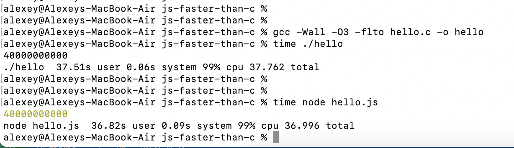

# Sample app to prove that JavaScript is faster than C

## How to benchmark C app

```
gcc -Wall -O3 hello.c -o hello
time ./hello
```

## How to benchmark JS app

```
time node ./hello.js
```

## Results


